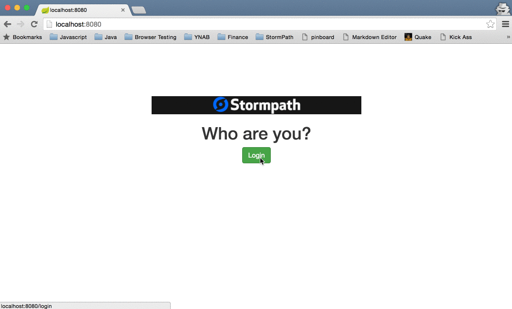

#Stormpath is Joining Okta
We are incredibly excited to announce that [Stormpath is joining forces with Okta](https://stormpath.com/blog/stormpaths-new-path?utm_source=github&utm_medium=readme&utm-campaign=okta-announcement). Please visit [the Migration FAQs](https://stormpath.com/oktaplusstormpath?utm_source=github&utm_medium=readme&utm-campaign=okta-announcement) for a detailed look at what this means for Stormpath users.

We're available to answer all questions at [support@stormpath.com](mailto:support@stormpath.com).

## Stormpath Spring Boot ReCaptcha Example

This is an example that updates the default `login` template to include a Google ReCaptcha widget.

*Note*: No new controllers are required to update `/login`. Simply updating the default template in the standard
location is all it takes.

Go [here](https://www.google.com/recaptcha) for more information on setting up ReCaptcha.

### Configuration

Aside from the regular Stormpath setup, you'll need to make the following changes:

1. Get your Google ReCaptcha Site Key and Secret Key from your [ReCaptcha](https://www.google.com/recaptcha) site.
2. Edit the [ReCaptchaFilter.java](https://github.com/stormpath/stormpath-spring-boot-recaptcha-example/blob/master/src/main/java/com/stormpath/spring/boot/examples/filter/ReCaptchaFilter.java#L36) file and put your Secret Key in `RECAPTCHA_SECRET`.
3. Edit the [login.html](https://github.com/stormpath/stormpath-spring-boot-recaptcha-example/blob/master/src/main/resources/templates/stormpath/login.html#L69) file and put your Site Key in the `div` that has the `g-recaptcha` class.

That's it! Fire it up and you will have a fully functioning ReCaptcha widget in your Spring Boot app.

